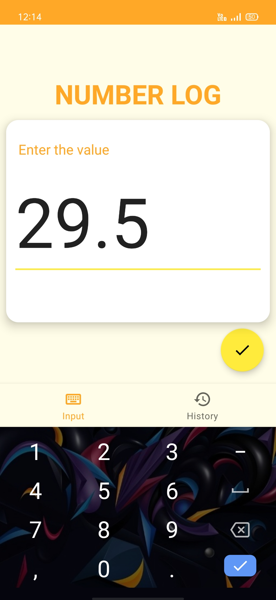
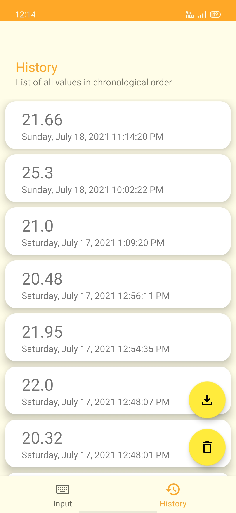

    
<h3 align="center">Number Log</h3>

# Number Log
A simple example android app. The app lets you log a float value along with the date and time.    
The value can directly be exported as a .csv file.    
    
The app is made using the MVVM architecture with ViewModel, LiveData and ViewBinding.    
Other jetpack components used are  
* Android Room, For persistent data storage  
* Jetpack Navigation, for navigation in the single activity app
* Paging 3, for pagination  
  
Hilt-Dagger is used for dependency injection and Coroutines for background database operations.

&nbsp; &nbsp;&nbsp; &nbsp; &nbsp;&nbsp;&nbsp;&nbsp;&nbsp;&nbsp;&nbsp;&nbsp;&nbsp;&nbsp;&nbsp;&nbsp;&nbsp;&nbsp;&nbsp;&nbsp;&nbsp;&nbsp; 

